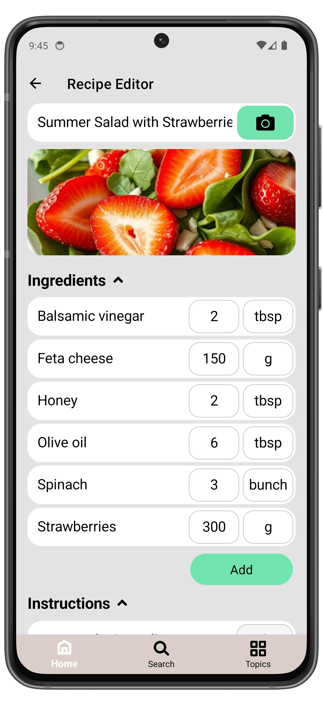

# Create Grocery List

There are two ways to create a Grocery List:  

### 1. Add items on the **Grocery List** page  
  - Open the **Grocery List** page
  - Tap the **Add Grocery** button
  - Enter the Grocery name and tap **OK**

  
  ➔
  

  
### 2. Add items from the recipe ingredients page
  - Go to the **Recipe** page
  - Open **Ingredients** and scroll down
  - Tap the **Add Grocery** button

  
  ➔
  

