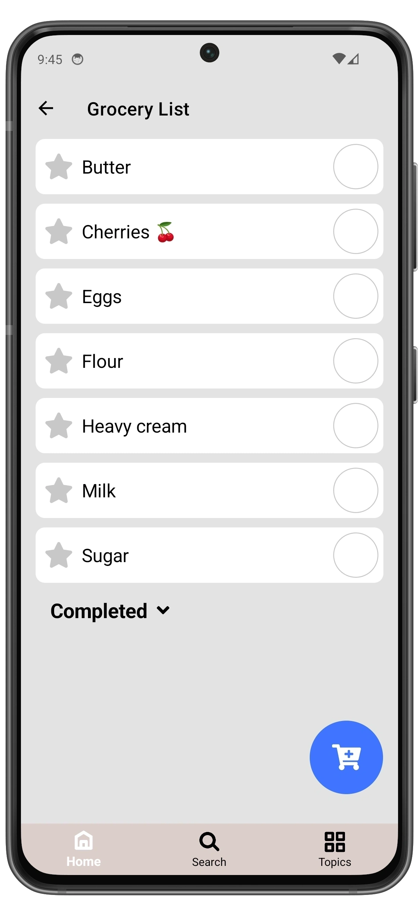

# Delete a Grocery

1. Open **Grocery List** page.
2. Find the grocery you want to delete and swipe right to left.
3. Tap **Delete**.
4. Confirm the deletion by tapping **Delete** again, otherwise tap **Cancel**.

  
  ➔
  
  ➔
  

