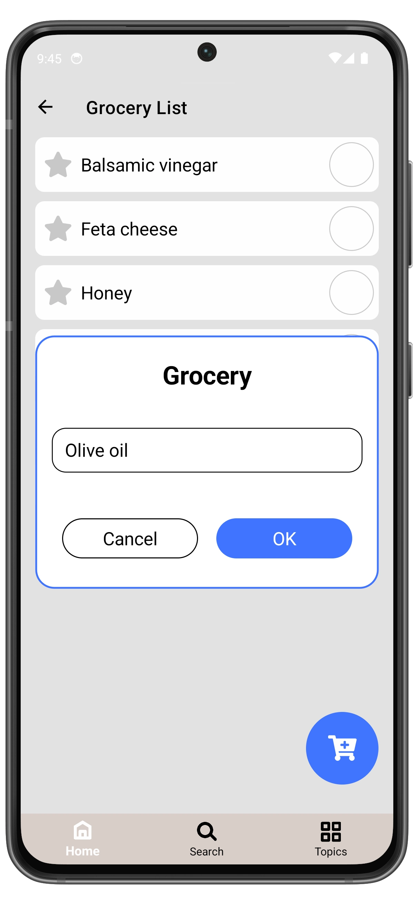

# Manage Groceries

1. Open **Grocery List** page.
2. Set the checkbox to mark the grocery as **Completed**.
3. Selected grocery item will be moved to the **Completed** list.

To view completed groceries, expand the **Completed** list.  
You can then delete the grocery or move it back by unchecking the checkbox.

  
  ➔
  
  ➔
  

