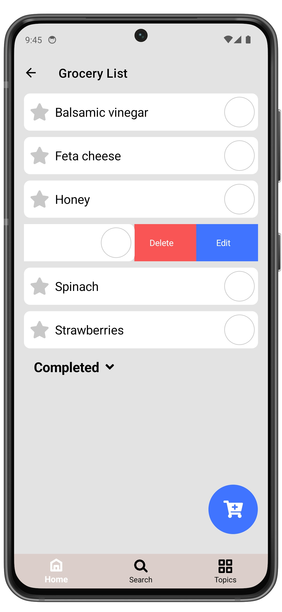

# Manage Groceries

1. Open **Grocery List** page.
2. Set the checkbox to mark the grocery as **Completed**.
3. Selected grocery item will be moved to the **Completed** list.

Expand the **Completed** list to view completed groceries.  
You can then delete the grocery or move it back by unchecking the checkbox.

  
  ➔
  

### Edit a Grocery

1. Open **Grocery List** page.
2. Select the grocery you want to edit and swipe right to left.
3. Tap **Edit**.

  
  ➔
  
  ➔
  

### Delete a Grocery
   
1. Open **Grocery List** page.
2. Select the grocery you want to delete and swipe right to left.
3. Tap **Delete**.
4. Confirm the deletion by tapping **Delete** again, otherwise tap **Cancel**.

  
  ➔
  
  ➔
  

