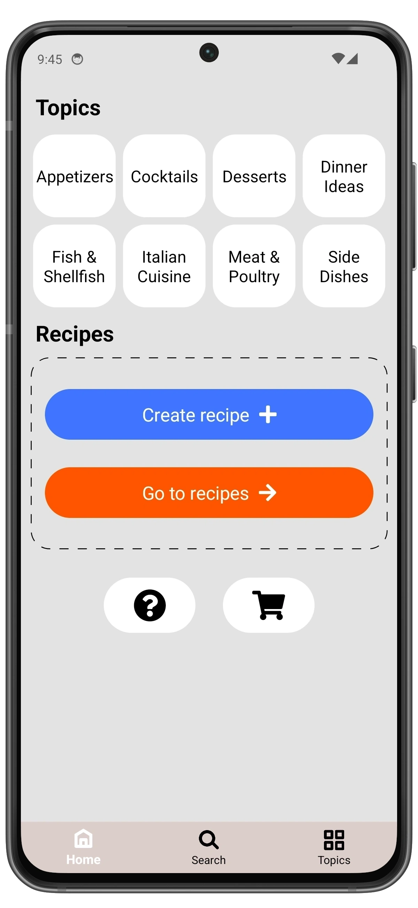

# Getting Started

This section will guide you through the basic steps of using the PieceOfCake app.

  
  ➔
  

## 🧁 Create Recipe

Open the app and tap the **Create recipe** button on the main screen.  

1. Enter a recipe name.  
2. Add a list of ingredients.  
3. Add preparation steps with optional photos for each.  
4. Optionally add a photo of the finished dish.

Any changes you make will be saved automatically.
