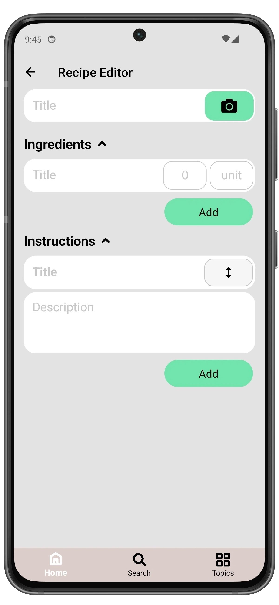

# Create a Recipe

Open the app and tap the **Create recipe** button on the main screen.  

1. Enter a recipe name.  
2. Add a list of ingredients.  
3. Add preparation steps with optional photos for each.  
4. Optionally add a photo of the finished dish by tapping the **Camera button**

  Any changes you make will be saved automatically.

  
  ➔
  

## Ingredients

Each ingredient includes:
- **Title**: Name of the ingredient (e.g., "Flour").
- **Quantity**: A numeric value (e.g., "0.5", "100").
- **Unit**: Optional unit of measurement (e.g., "g", "cup", "tbsp").

Ingredients are added one by one, but after saving the recipe, they will be sorted in alphabetical order.

## Instructions

Each instruction step includes:
- **Title**: Short description of the step.
- **Description**: A more detailed explanation of what to do.
- **Photo (optional)**: You can attach a photo to any step to visualize the process.

The order of steps defines the recipe flow.
