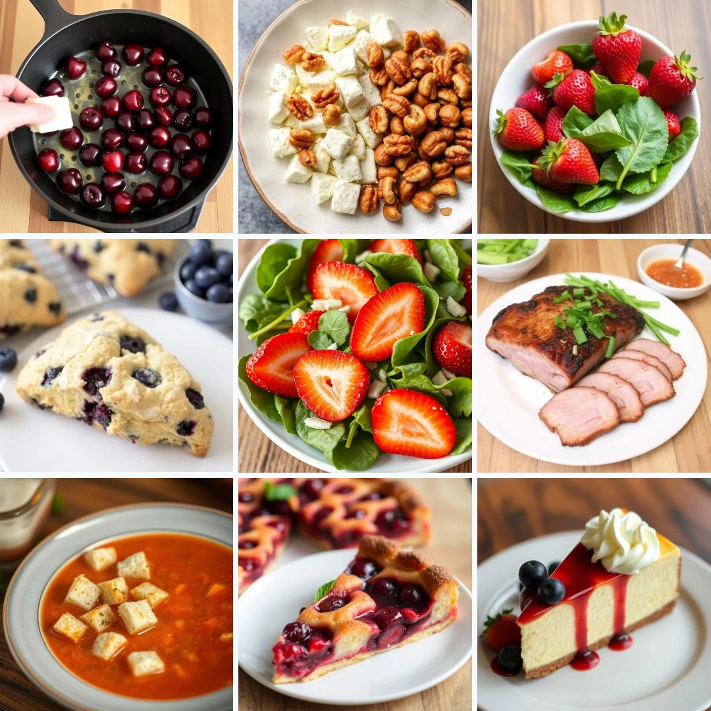

# Create a Recipe

Open the app and tap the **Create recipe** button on the main screen.  

1. Enter a recipe name.  
2. Add a list of ingredients.  
3. Add preparation steps with optional photos for each.  
4. Optionally add a photo of the finished dish by tapping the **Camera button**

  Any changes you make will be saved automatically.

  
  ➔
  

## Ingredients

Each ingredient includes:
- **Title**: Name of the ingredient (e.g., "Flour").
- **Quantity**: A numeric value (e.g., "0.5", "100").
- **Unit**: Optional unit of measurement (e.g., "g", "cup", "tbsp").

Ingredients are added one by one, but after saving the recipe, they will be sorted in alphabetical order.

If you want to set a different sorting order, add numbers to the ingredient names.  
Ingredients with numbers will be sorted according to the numbering, while ingredients without numbers will appear at the end of the list.

Ingredients can be grouped by recipe components. To do this, write the group name before the ingredient name  
in the following format: "group name: ingredient name". The group name should be placed before each ingredient that belongs to the same group.

### Delete Ingredient

To delete an ingredient:
1. Swipe the ingredient from right to left.
2. Tap **Delete**.

  The ingredient will be removed without confirmation.

## Instructions

Each instruction step includes:
- **Title**: Short description of the step.
- **Description**: A more detailed explanation of what to do.
- **Photo (optional)**: You can attach a photo to any step to visualize the process.

The order of steps defines the recipe flow.  

Instruction steps are added one by one, but you can change their order using drag and drop.  
To reorder steps:
1. Tap and hold the **arrow button** until you feel a vibration.
2. Drag the step to the desired position, aligning the arrow buttons.
3. Release to confirm the new position.

### Adding a Photo

To add a photo to an instruction step, swipe from left to right on the step description.  
Tap "Add Photo."

  
  ➔
  
  ➔
  

### Delete Instruction step

To delete an instruction step:
1. Swipe from right to left on the instruction title.
2. Tap "Delete".

  The instruction step will be removed without confirmation.

