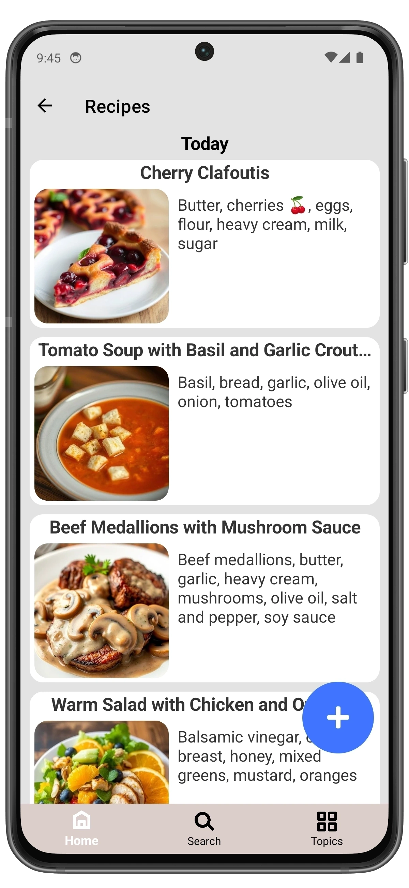

## Delete a Recipe

  
  ➔
  
  ➔
  

1. Open the Recipes page.
2. Find the recipe you want to delete and swipe right to left.
3. Tap **Delete**.
4. Confirm the deletion by tapping **Delete** again.
