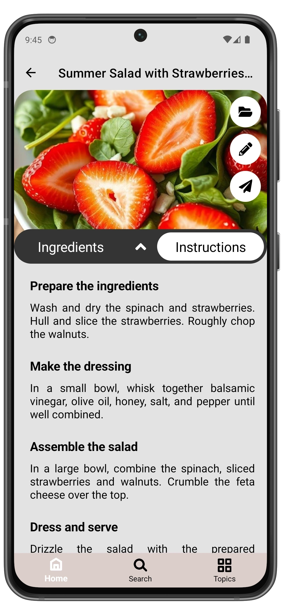

# Manage Recipes

You can access the **Recipe** page in several ways:
- Open the **Topic** that contains the recipe.
- Open the **Recipes** page and find the recipe you need.
- Go to the **Search** page and enter the recipe name or ingredient.
- The last five recipes are also displayed on the Home page.

  
  ➔
  

