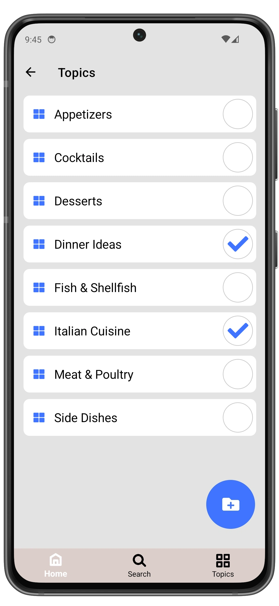
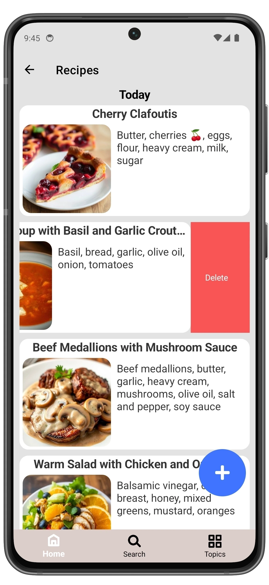

# Manage Recipe

You can access the **Recipe** page in several ways:
- Open the **Topic** that contains the recipe.
- Open the **Recipes** page and find the recipe you need.
- Go to the **Search** page and enter the recipe name or ingredient.
- The last five recipes are also displayed on the Home page.

  
  ➔
  

 

On the **Recipe** page, you can:

1. Add the **Recipe** to a **Topic**
2. Go to the recipe **Editing** page
3. Share the recipe using services (email, messengers, and other apps).
   

  
  ➔
  

 

  
  ➔
  

  

You can mark completed instruction steps and used ingredients while cooking.

  
  ➔
  

 

## Delete Recipe

1. Open **Recipes** page by tapping **Go to recipes**.
2. Select the recipe you want to delete and swipe right to left.
3. Tap **Delete**.
4. Confirm the deletion by tapping **Delete** again, otherwise tap **Cancel**.

  
  ➔
  
  ➔
  

