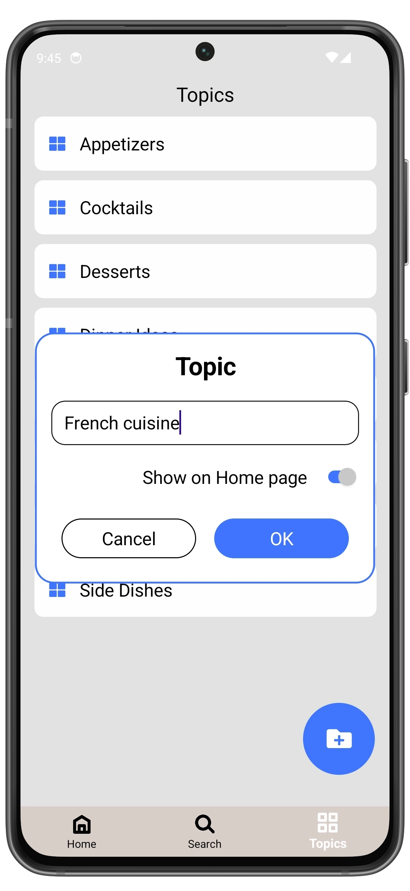

# Create a Topic

1. Open **Topics** page.
3. Tap the **Add topic** button.
4. Enter the topic name and choose whether to display the topic on the Home screen.

If **"Show on Home page"** is selected, the topic will be displayed on the Home screen.

  
  ➔
  

