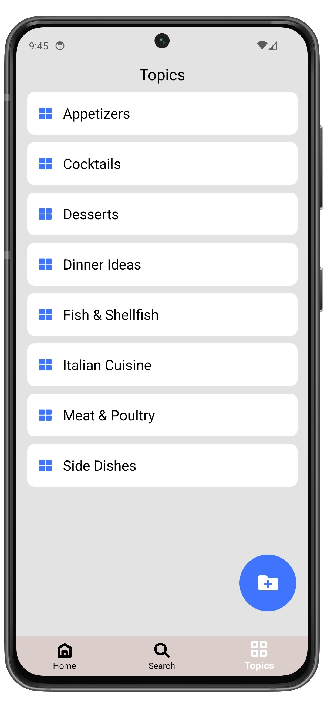
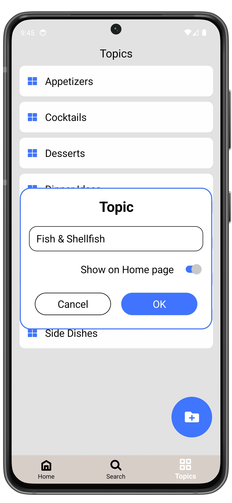

# Manage a Topic

## Edit a Topic

1. Open **Topics** page.
2. Select the topic you want to edit and swipe right to left.
3. Tap **Edit**.
4. To confirm the changes, tap **OK** button, otherwise tap **Cancel**.

  
  ➔
  
  ➔
  

## Delete a Topic

1. Open **Topics** page.
2. Select the topic you want to delete and swipe right to left.
3. Tap **Delete**.
4. Confirm the deletion by tapping **Delete** again, otherwise tap **Cancel**.

Deleting a topic will not remove the recipes linked to it.  
Recipes will still be available on the **Recipes** page or the **Search** page.

  
  ➔
  
  ➔
  

