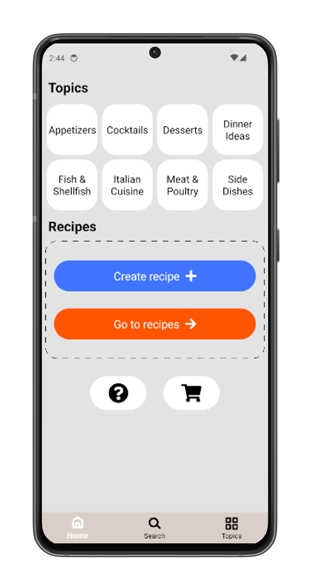
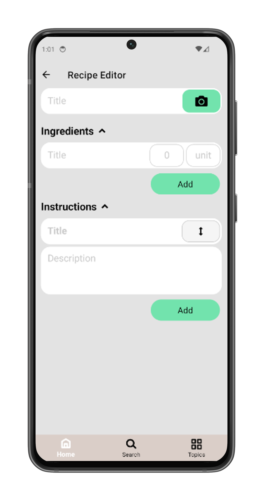

# Getting Started

This section will guide you through the basic steps of using the PieceOfCake app.

  
  

## 🧁 Creating Recipe

1. Open the app and tap the **Create recipe** button on the main screen.  
2. Enter a recipe name.  
3. Add a list of ingredients.  
4. Add preparation steps with optional photos for each.  
5. Optionally add a photo of the finished dish.
6. Any changes you make will be saved automatically.

## 🗂️ Managing Recipes

Once you've created a recipe, you can easily organize and update it:

- **Move to a Topics**:  
  1. Open the recipe.  
  2. Tap the **Edit** icon.  
  3. Select or create a topic (category) to organize your recipes.

